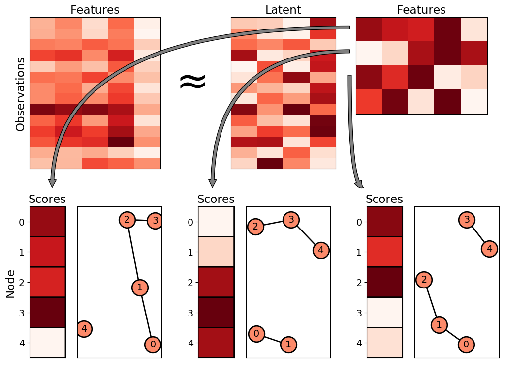

# prmf
Pathway-Regularized Matrix Factorization

[Slides from ISMB2018](https://figshare.com/articles/Pathway-Regularized_Matrix_Factorization_Slides/6845648)

## Dependencies
- Python (3.7.0)
-- numpy
-- scipy
-- matplotlib
-- sklearn
-- networkx
- R (3.5.1)
-- KEGGREST
-- KEGGgraph
-- graph
-- igraph
-- argparse
